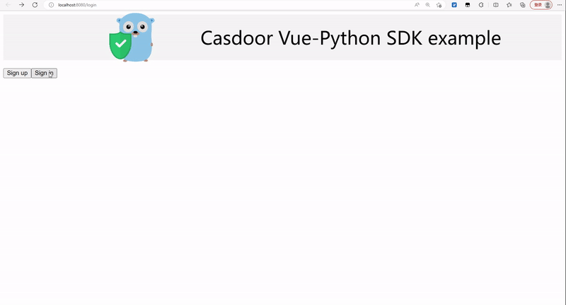
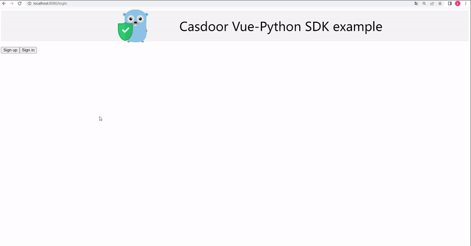

<h1 align="center" style="border-bottom: none;">📦⚡️Casdoor Vue + Python example</h1>
<h3 align="center">An example of casdoor-vue-sdk and casdoor-python-sdk</h3>

## Architecture

Example contains 2 parts:

| Name     | SDK                | Language         | Source code                                                               |
|----------|--------------------|------------------|---------------------------------------------------------------------------|
| Frontend | casdoor-vue-sdk    | Javascript + Vue | https://github.com/casdoor/casdoor-python-vue-sdk-example/tree/master/web |
| Backend  | casdoor-python-sdk | Python + Flask   | https://github.com/casdoor/casdoor-python-vue-sdk-example                 |

## Installation

Example uses Casdoor to manage members. So you need to create an organization and an application for the example in a Casdoor instance. For how to install Casdoor, see: https://casdoor.org/docs/basic/server-installation

### Get the code

```shell
git clone https://github.com/casdoor/casdoor-python-vue-sdk-example
```

## Configuration

### Frontend

```js
// in web/src/config.js
export let serverUrl = `http://localhost:5000` // port where Python backend runs
```

```js
// in web/src/main.js
const config = {
  serverUrl: "https://door.casdoor.com", // Casdoor server URL
  clientId: "294b09fbc17f95daf2fe",
  organizationName: "casbin",
  appName: "app-vue-python-example",
  redirectPath: "/callback",
};
```

### Backend

```python
# in config.py
# certificate:get in your Casdoor server -> application
certificate = '''-----BEGIN CERTIFICATE-----
MIIE+TCCAuGgAwIBAgIDAeJAMA0GCSqGSIb3DQEBCwUAMDYxHTAbBgNVBAoTFENh
c2Rvb3IgT3JnYW5pemF0aW9uMRUwEwYDVQQDEwxDYXNkb29yIENlcnQwHhcNMjEx
MDE1MDgxMTUyWhcNNDExMDE1MDgxMTUyWjA2MR0wGwYDVQQKExRDYXNkb29yIE9y
Z2FuaXphdGlvbjEVMBMGA1UEAxMMQ2FzZG9vciBDZXJ0MIICIjANBgkqhkiG9w0B
AQEFAAOCAg8AMIICCgKCAgEAsInpb5E1/ym0f1RfSDSSE8IR7y+lw+RJjI74e5ej
rq4b8zMYk7HeHCyZr/hmNEwEVXnhXu1P0mBeQ5ypp/QGo8vgEmjAETNmzkI1NjOQ
CjCYwUrasO/f/MnI1C0j13vx6mV1kHZjSrKsMhYY1vaxTEP3+VB8Hjg3MHFWrb07
uvFMCJe5W8+0rKErZCKTR8+9VB3janeBz//zQePFVh79bFZate/hLirPK0Go9P1g
OvwIoC1A3sarHTP4Qm/LQRt0rHqZFybdySpyWAQvhNaDFE7mTstRSBb/wUjNCUBD
PTSLVjC04WllSf6Nkfx0Z7KvmbPstSj+btvcqsvRAGtvdsB9h62Kptjs1Yn7GAuo
I3qt/4zoKbiURYxkQJXIvwCQsEftUuk5ew5zuPSlDRLoLByQTLbx0JqLAFNfW3g/
pzSDjgd/60d6HTmvbZni4SmjdyFhXCDb1Kn7N+xTojnfaNkwep2REV+RMc0fx4Gu
hRsnLsmkmUDeyIZ9aBL9oj11YEQfM2JZEq+RVtUx+wB4y8K/tD1bcY+IfnG5rBpw
IDpS262boq4SRSvb3Z7bB0w4ZxvOfJ/1VLoRftjPbLIf0bhfr/AeZMHpIKOXvfz4
yE+hqzi68wdF0VR9xYc/RbSAf7323OsjYnjjEgInUtRohnRgCpjIk/Mt2Kt84Kb0
wn8CAwEAAaMQMA4wDAYDVR0TAQH/BAIwADANBgkqhkiG9w0BAQsFAAOCAgEAn2lf
DKkLX+F1vKRO/5gJ+Plr8P5NKuQkmwH97b8CS2gS1phDyNgIc4/LSdzuf4Awe6ve
C06lVdWSIis8UPUPdjmT2uMPSNjwLxG3QsrimMURNwFlLTfRem/heJe0Zgur9J1M
8haawdSdJjH2RgmFoDeE2r8NVRfhbR8KnCO1ddTJKuS1N0/irHz21W4jt4rxzCvl
2nR42Fybap3O/g2JXMhNNROwZmNjgpsF7XVENCSuFO1jTywLaqjuXCg54IL7XVLG
omKNNNcc8h1FCeKj/nnbGMhodnFWKDTsJcbNmcOPNHo6ixzqMy/Hqc+mWYv7maAG
Jtevs3qgMZ8F9Qzr3HpUc6R3ZYYWDY/xxPisuKftOPZgtH979XC4mdf0WPnOBLqL
2DJ1zaBmjiGJolvb7XNVKcUfDXYw85ZTZQ5b9clI4e+6bmyWqQItlwt+Ati/uFEV
XzCj70B4lALX6xau1kLEpV9O1GERizYRz5P9NJNA7KoO5AVMp9w0DQTkt+LbXnZE
HHnWKy8xHQKZF9sR7YBPGLs/Ac6tviv5Ua15OgJ/8dLRZ/veyFfGo2yZsI+hKVU5
nCCJHBcAyFnm1hdvdwEdH33jDBjNB6ciotJZrf/3VYaIWSalADosHAgMWfXuWP+h
8XKXmzlxuHbTMQYtZPDgspS5aK+S4Q9wb8RRAYo=
-----END CERTIFICATE-----'''

CASDOOR_SDK = CasdoorSDK(
        endpoint='https://door.casdoor.com', # Casdoor server URL
        client_id='294b09fbc17f95daf2fe',
        client_secret='dd8982f7046ccba1bbd7851d5c1ece4e52bf039d',
        certificate=certificate,
        org_name='casbin',
        application_name='app-vue-python-example',
    )
```

- install dependencies

  ```shell
  PS .\casdoor-python-vue-sdk-example\web> yarn install
  PS .\casdoor-python-vue-sdk-example> pip install -r requirements.txt
  ```

- run

For Linux:

  ```
  user@machine:/casdoor-python-vue-sdk-example/web$ yarn serve
  user@machine:/casdoor-python-vue-sdk-example$ ./venv/Scripts/python app.py
  ```

For Windows:

  ```
  PS .\casdoor-python-vue-sdk-example\web> yarn serve
  PS .\casdoor-python-vue-sdk-example> venv\Scripts\python.exe app.py
  ```

- Now, example runs its front end at port 8080 and runs it's back end at port 5000. You can modify the code and see what will happen.

### Demo videos

1. Normal login:



2. Silent login:


