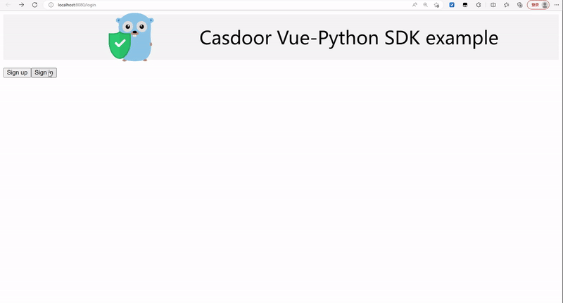
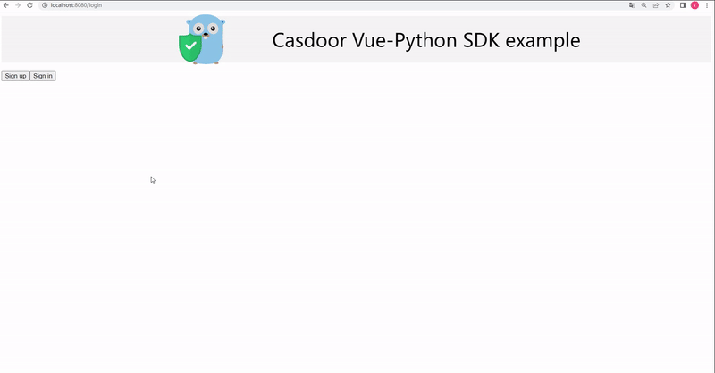

# Casdoor Python (Flask) + Vue Example

[](https://github.com/casdoor/casdoor-python-vue-sdk-example/actions/workflows/build.yml)
[](https://github.com/casdoor/casdoor-python-vue-sdk-example/blob/master/LICENSE)
[](https://discord.gg/5rPsrAzK7S)

An example web app that signs users in with [Casdoor](https://casdoor.ai/), with a Vue frontend and a Python (Flask) backend.

| Part     | SDK                                                               | Language           | Port |
|----------|-------------------------------------------------------------------|--------------------|------|
| Frontend | [casdoor-vue-sdk](https://github.com/casdoor/casdoor-vue-sdk)     | JavaScript + Vue 3 | 8080 |
| Backend  | [casdoor-python-sdk](https://github.com/casdoor/casdoor-python-sdk) | Python + Flask | 5000 |

Normal login:



Silent login:



## How it works

1. The frontend redirects the user to the Casdoor sign-in page (`getSigninUrl()` of casdoor-vue-sdk).
2. After signing in, Casdoor redirects back to `http://localhost:8080/callback` with `code` and `state`.
3. The callback page sends them to the backend: `POST /api/signin?code=...&state=...`.
4. The backend exchanges the code for an access token (`sdk.get_oauth_token()`), verifies it with the certificate (`sdk.parse_jwt_token()`) and keeps the user in the session.
5. The frontend reads the signed-in user from `GET /api/get-account` and signs out with `POST /api/signout`.

| API                     | Description                                             |
|-------------------------|---------------------------------------------------------|
| `POST /api/signin`      | Exchanges the code for a token and starts the session   |
| `GET /api/get-account`  | Returns the user of the session                         |
| `POST /api/signout`     | Ends the session                                        |

## Prerequisites

- Python 3.9+
- Node.js 18+ and Yarn
- A Casdoor server. The example is preconfigured for the public demo server https://door.casdoor.com, so it runs as is. To use your own, see [Casdoor installation](https://casdoor.ai/docs/basic/server-installation).

## Configuration

Skip this section to try the example with the public demo server.

In your Casdoor, create (or reuse) an organization and an application, and add `http://localhost:8080/callback` to the application's **Redirect URLs**. Then fill in both parts:

### Frontend

[web/src/main.js](web/src/main.js):

```js
const config = {
  serverUrl: "https://door.casdoor.com", // Casdoor server URL
  clientId: "294b09fbc17f95daf2fe", // client ID of the application
  organizationName: "casbin", // organization of the application
  appName: "app-vue-python-example", // name of the application
  redirectPath: "/callback",
};
```

[web/src/config.js](web/src/config.js) holds the URL of the backend:

```js
export let serverUrl = `http://localhost:5000`
```

### Backend

[config.py](config.py):

```python
# the certificate of the cert used by the application: Casdoor -> Certs -> the cert -> Certificate
certificate = '''-----BEGIN CERTIFICATE-----
...
-----END CERTIFICATE-----'''

CASDOOR_SDK = CasdoorSDK(
    endpoint='https://door.casdoor.com',  # Casdoor server URL
    client_id='294b09fbc17f95daf2fe',  # client ID of the application
    client_secret='dd8982f7046ccba1bbd7851d5c1ece4e52bf039d',  # client secret of the application
    certificate=certificate,
    org_name='casbin',  # organization of the application
    application_name='app-vue-python-example',  # name of the application
)
```

## Run

```shell
git clone https://github.com/casdoor/casdoor-python-vue-sdk-example
cd casdoor-python-vue-sdk-example
```

Backend, at http://localhost:5000:

```shell
python -m venv venv
source venv/bin/activate  # on Windows: venv\Scripts\activate
pip install -r requirements.txt
python app.py
```

Frontend, at http://localhost:8080:

```shell
cd web
yarn install
yarn serve
```

Open http://localhost:8080 and click **Sign in**.

## Resources

- [Casdoor documentation](https://casdoor.ai/docs/overview)
- [casdoor-python-sdk](https://github.com/casdoor/casdoor-python-sdk)
- [casdoor-vue-sdk](https://github.com/casdoor/casdoor-vue-sdk)

## License

[Apache-2.0](LICENSE)
